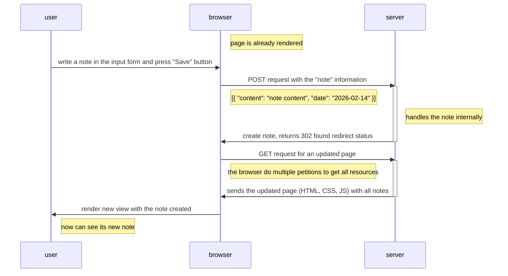

```mermaid
sequenceDiagram
    participant user
    participant browser
    participant server

    Note right of browser: page is already rendered
    user->> browser: write a note in the input form and press "Save" button   ;
    
    browser ->> server : POST request with the "note" information;
    activate server
    Note right of browser: [{ "content": "note content", "date": "2026-02-14" }]
    

    Note right of server: handles the note internally
    server->>browser: create note, returns 302 found redirect status 
    deactivate server
    
    browser ->> server : GET request for an updated page ;

    activate server
    Note right of browser: the browser do multiple petitions to get all resources
    server->>browser: sends the updated page (HTML, CSS, JS) with all notes;
    deactivate server


    browser->> user: render new view with the note created ;
    Note right of user: now can see its new note
```